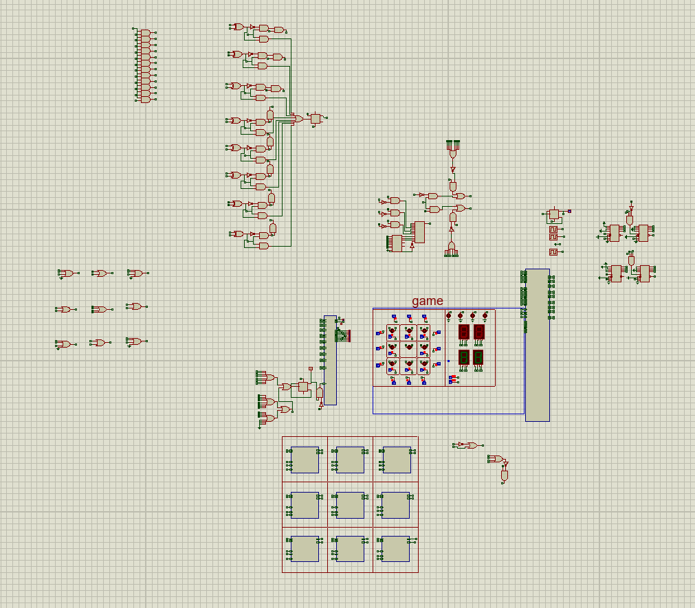
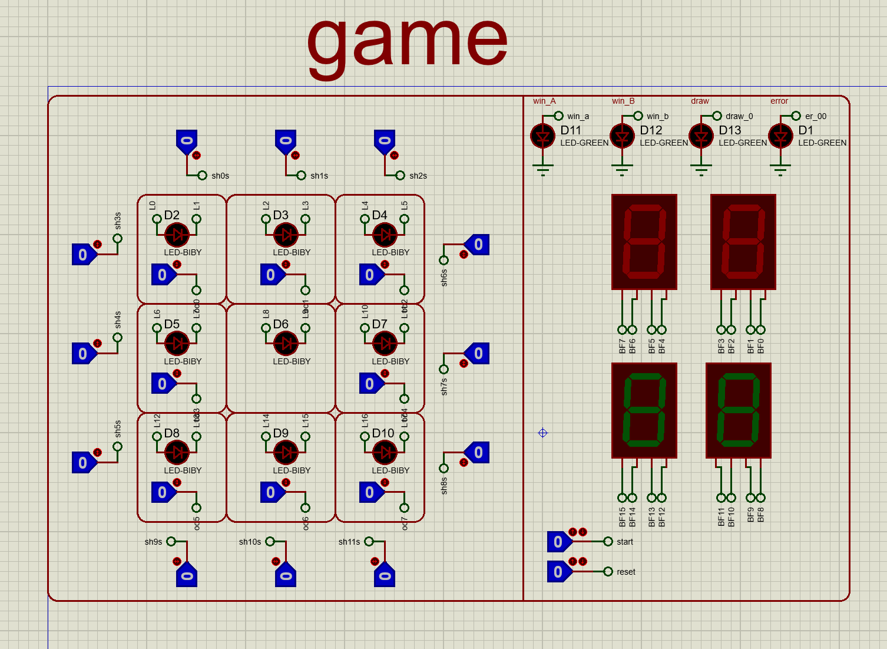
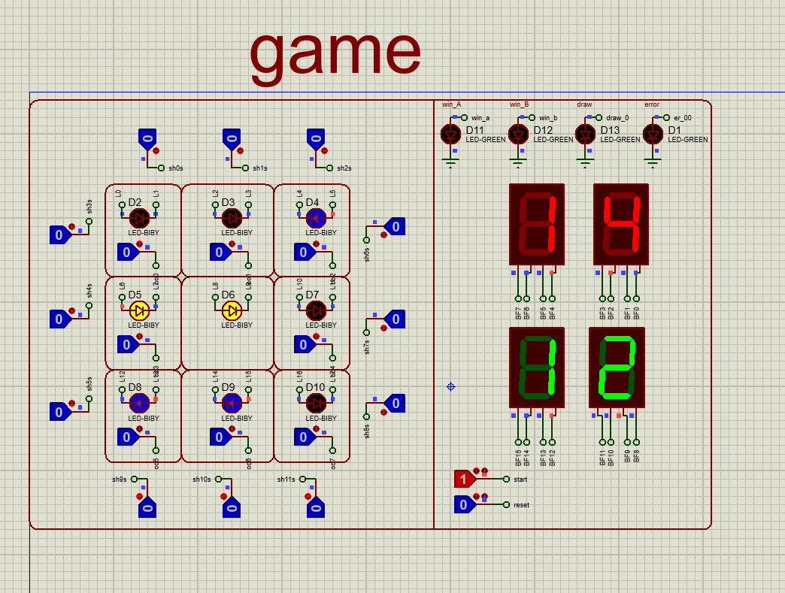
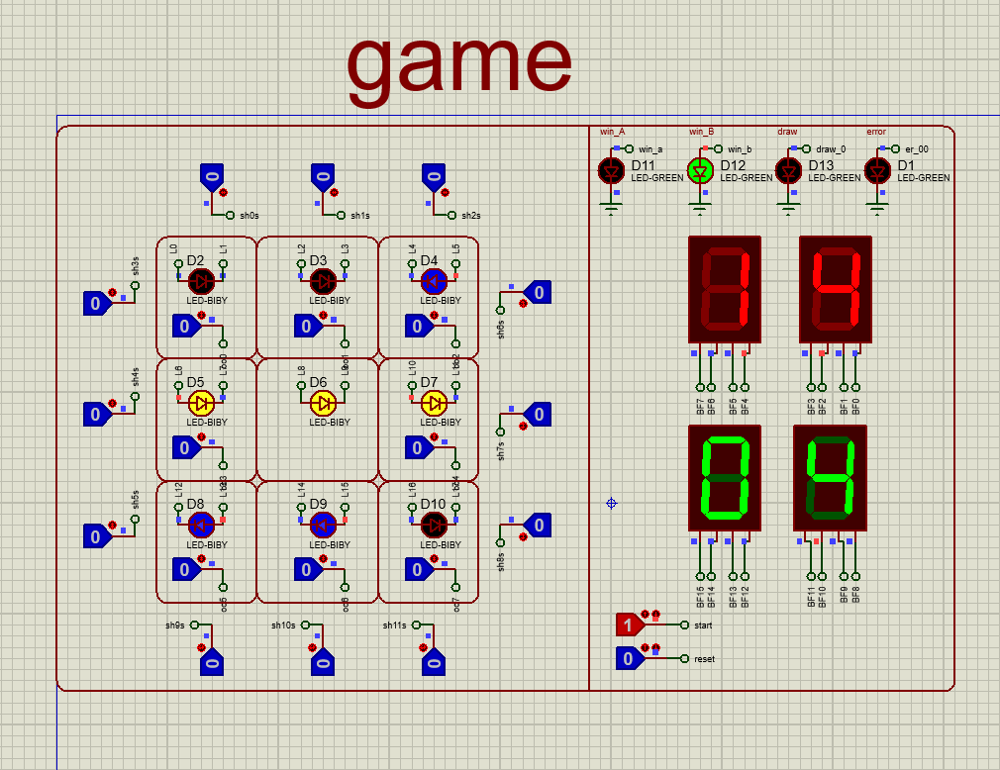

# Rotating-Tic-Tac-Toe-Digital-Circuits-Final-Project
This repository contains the hardware implementation of a modified version of Tic-Tac-Toe with all of the optional bonus features built and simulated using Proteus, developed as the final project for the Digital Circuits course at the University of Guilan.

# 🧠 Game Description
This is a 3x3 board game inspired by classic Tic-Tac-Toe with an added twist: rotational moves. Players alternately choose one of the edge cells and then rotate its corresponding row or column. The goal is to align three same symbols (X or O) in a row, column, or diagonal — with the catch that each move dynamically alters the board layout.

Board cells are numbered 1–9 (like a keypad).

Each move has two phases:

Edge Cell Selection: Only edge cells (not the center) are selectable.

Row/Column Rotation: Player rotates the selected row/column (left/right or up/down).

🛠️ Implementation Overview
Each cell includes two LEDs (for X and O) and two push-buttons (to select either).

Rotation buttons are placed next to each edge cell.

Game starts only when the Start button is pressed.

Includes timers for each player (15 seconds per turn).

When the game ends (win or timeout), a win indicator LED activates and timers stop.

Game can be restarted only by pressing Reset.

# ✅ Rules and Features
No move can occur before pressing Start.

Players must select valid edge cells and make valid rotations.

LEDs reflect moves and rotations in real-time.

Game ends on:

Victory (three aligned symbols)

Timeout

(Optional) Tie 

Designed for error-free inputs (optional bonus: fault tolerance).

Win highlighting: LEDs blink when a winning line is formed (optional bonus).

# 🌟 Optional Bonus Features 
Single-button cell selection using multicolor LEDs

Winning line LED blinking

Fault detection for invalid moves (e.g., selecting already lit cell)

Tie detection and LED indication

# 🧪 Hardware Platform
Implemented and simulated in Proteus

# Pictures:

# Team members: 

https://github.com/BehrazFS  
https://github.com/RozhinaLatifi
